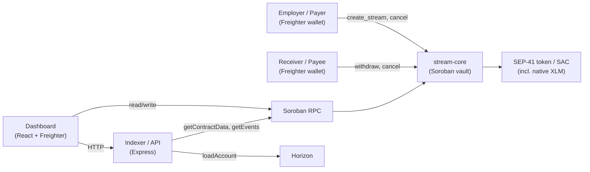
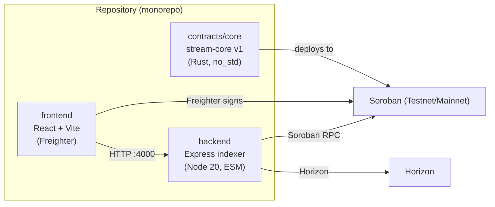

# StellarStream-Pay — System Architecture

This document describes the architecture of StellarStream-Pay: a **continuous,
linearly-vesting payment-stream primitive** on Stellar / Soroban. It is written
in the style of the [C4 model](https://c4model.com/) (Context → Containers →
Components) and covers the contract's storage, events, and security invariants.

---

## 1. System Context

StellarStream-Pay lets a **sender** stream a token amount to a **receiver** over
a fixed duration. Funds are locked in a Soroban vault contract and become
claimable pro-rata as time passes. No trusted intermediary holds the funds — the
contract is self-custodial and the settlement logic is on-chain.



**Actors**

- **Sender** — locks funds and starts a stream (`create_stream`), or cancels it.
- **Receiver** — withdraws the accrued amount (`withdraw`), or cancels it.
- **Both** may cancel: the vested remainder goes to the receiver and the
  unvested remainder returns to the sender, atomically.

**External systems**

- **Soroban RPC** — reads contract storage and events, and simulates/submits
  transactions.
- **Horizon** — reads classic account balances (XLM and trustlines).
- **SEP-41 token / SAC** — the asset being streamed, including Stellar Asset
  Contracts for native XLM and issued assets.

---

## 2. Containers

The system is split into three deployable containers plus the on-chain contract.



| Container | Responsibility | Technology |
|-----------|---------------|------------|
| `stream-core` | Locks funds, enforces linear vesting, settles withdrawals and cancellations, emits lifecycle events | Rust, `soroban-sdk` 27, `#![no_std]` |
| `backend` | Reads contract storage and events, decorates stream state (`accrued`, `withdrawable`, `progress`), serves a JSON API | Node 20, Express, `@stellar/stellar-sdk` |
| `frontend` | Wallet connection, stream dashboard, and transaction assembly/signing | React 18, Vite, `@stellar/freighter-api` |

---

## 3. Contract components

### 3.1 Storage layout

Persistent storage is keyed through the `DataKey` enum (`#[contracttype]`):

| Key | Value | Purpose |
|-----|-------|---------|
| `DataKey::Counter` | `u64` | Monotonic stream-id counter |
| `DataKey::Stream(u64)` | `Stream` | Metadata for stream `id` |

A `Stream` records `sender`, `receiver`, `token`, `total_amount`, `start_time`,
`end_time`, `withdrawn`, `cancelled`, and `cancelled_at`. Amounts are `i128`
(base units; stroops for SAC assets) and time is ledger-close time (unix
seconds).

### 3.2 Lifecycle events

Every state change publishes a `StreamEvent` (`#[contractevent]`) so indexers can
track streams without polling storage:

- Topics: `[stream_event, kind, stream_id, sender, receiver]`
  (`kind ∈ {created, withdraw, cancelled}`)
- Data: `{ token, amount, start_time, end_time }` (map format)

The backend's `/api/events` endpoint queries these via Soroban RPC `getEvents`
with topic filters.

### 3.3 The settlement invariant

The core's safety property, asserted by property-based tests:

> `total_amount == withdrawn + refund` after a `cancel`, and, at any point while
> active, `withdrawable == accrued − withdrawn` with
> `0 ≤ withdrawn ≤ accrued ≤ total_amount`.

Cancellation freezes vesting at `cancelled_at`; the receiver can still withdraw
the portion that vested before the freeze.

### 3.4 Vesting math

```text
                  min(now, end) − start
   accrued(t) = total × ───────────────────   (floored)
                        end − start
```

`vested_amount` is a pure function, so the `proptest` suite verifies it is
bounded, monotonic in time, and an exact floor division.

---

## 4. Key flows

### 4.1 Create stream

```mermaid
sequenceDiagram
    participant S as Sender (Freighter)
    participant C as stream-core
    participant T as Token (SAC/SEP-41)

    S->>C: create_stream(sender, receiver, token, amount, duration)
    C->>C: require_auth(sender); validate inputs
    C->>C: write Stream + Counter (CEI)
    C->>T: transfer(sender -> contract, amount)
    C->>C: assert balance delta == amount (fee-on-transfer guard)
    C-->>S: stream_id; emit StreamEvent(created)
```

### 4.2 Withdraw

1. Receiver calls `withdraw(receiver, stream_id)`.
2. Contract checks `receiver.require_auth()` and that the caller is the stream's
   receiver.
3. `withdrawn` is updated **before** the token transfer (check-effects-interactions).
4. The accrued-but-unwithdrawn amount is pushed from the contract to the receiver.

### 4.3 Cancel (either party)

1. Sender or receiver calls `cancel(caller, stream_id)`.
2. Contract checks `caller.require_auth()` and that `caller` is a party to the
   stream (and it is not already cancelled).
3. Vesting freezes at `cancelled_at`; `withdrawn` is set to the accrued amount.
4. The un-withdrawn vested remainder is paid to the receiver; the unvested
   remainder is refunded to the sender — in a single atomic call.

---

## 5. Extension model (roadmap)

`stream-core` is a **frozen primitive**, not a platform. New capabilities ship as
separate contracts that compose it by `Address`:

```text
                     ┌──────────────────────────┐
                     │       stream-core (v1)    │  frozen, auditable
                     └───────────▲──────────────┘
                                 │  calls into
   ┌───────────────┬─────────────┼─────────────┬───────────────┐
   │ split streams │ schedules   │ payroll     │ tokenized     │
   │ (fan-out)     │ (cliff/     │ (atomic     │ positions     │
   │               │  back-wtd)  │  multi)     │ (trade cash)  │
   └───────────────┴─────────────┴─────────────┴───────────────┘
```

Extensions never modify the core; they hold its `Address` and orchestrate
multiple core calls. This keeps the settlement logic auditable and unchanged
while the ecosystem grows around it.

---

## 6. Security & trust assumptions

- **Authorization** — `create_stream`/`withdraw`/`cancel` each `require_auth()`
  the acting party; token transfers flow through SEP-41 `token::Client`, which
  enforces its own auth.
- **Check-effects-interactions** — state is written before external token calls.
- **Overflow safety** — `overflow-checks = true` in the release profile traps
  arithmetic overflow rather than wrapping.
- **Fee-on-transfer rejection** — `create_stream` verifies the contract actually
  received exactly `amount`, rejecting non-conforming tokens.
- **TTL management** — persistent entries are TTL-bumped on write so long-running
  streams are not archived mid-term.
- **Trust boundary** — the contract trusts the *behavior* of the token it is
  asked to stream. A token that lies about its own balance can only underpay
  itself; real deployments should stream SAC or allow-listed tokens.

See [SECURITY.md](../SECURITY.md) for the vulnerability-disclosure process.
